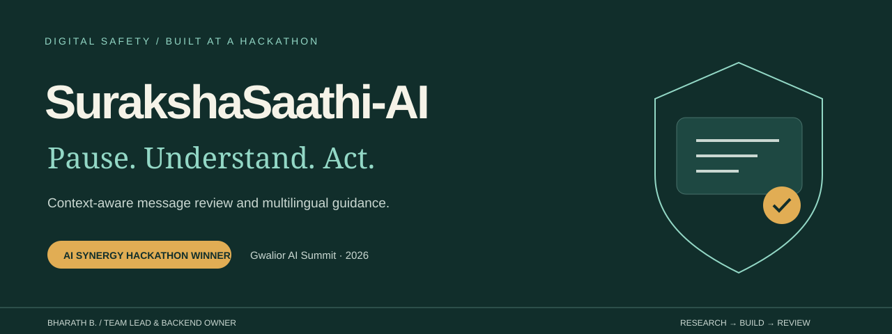
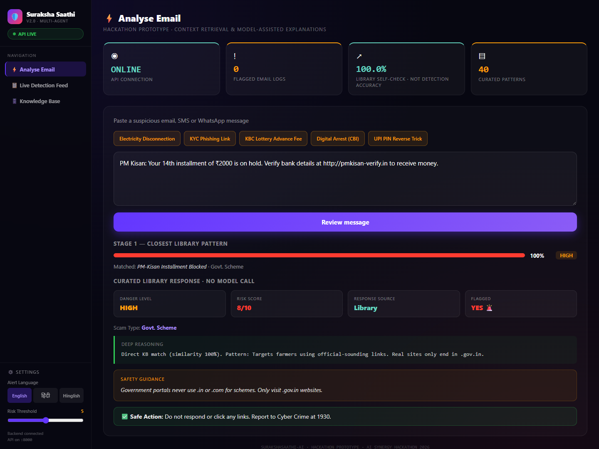

<p align="center">
  
</p>

<p align="center">
  <strong>Message risk review that explains the warning.</strong><br />
  A hackathon prototype for reviewing suspicious messages, understanding manipulation tactics, and finding a practical next step.
</p>

<p align="center">
  <a href="#the-build">The build</a> · <a href="#my-contribution">My contribution</a> · <a href="#run-locally">Run locally</a> · <a href="#try-the-demo">Try the demo</a> · <a href="#what-the-scores-mean">Scores & limitations</a>
</p>

---

## The build

**Winner — AI Synergy Hackathon 2026, Gwalior AI Summit.**

A message can look official and still be a scam. SurakshaSaathi-AI connects a suspicious message with a curated reference pattern, then uses Gemini to explain the risk and the tactics behind it. Advice is available in English, Hindi, and Hinglish.

The project brings together a React dashboard, a FastAPI backend, an optional Gmail inbox monitor, and a Telegram bot. It is a hackathon prototype, with a working local demo and explicit limits on what its scores establish.

| In the repository | What it means |
| --- | --- |
| **40 curated patterns** | Reference examples across government impersonation, job scams, banking/UPI, and shopping/social fraud |
| **3 advice languages** | English, Hindi, and Hinglish; this does not imply equally validated detection in all three languages |
| **5 API endpoints** | Message review, email logs, pattern search, statistics, and health |
| **~16-hour backend build** | Time I spent bringing the backend services together at the hackathon |

## My contribution

I'm **Bharath B.**, the team's lead and backend owner. During the hackathon, I connected the services that turn a message into a usable explanation:

- **Ingestion:** Gmail IMAP polling, email decoding, and message extraction.
- **Retrieval:** matching incoming text against a curated scam-pattern library.
- **Analysis:** two Gemini stages for risk scoring and contextual explanation.
- **Delivery:** FastAPI responses, multilingual advice, structured logs, and Telegram alerts.

The React dashboard presents these results. Backend ownership is my contribution; the full project is a team build.

**Find me:** [Portfolio](https://bharat122551b.vercel.app/) · [LinkedIn](https://www.linkedin.com/in/bharath-b-7894b5382/) · [GitHub](https://github.com/Bharath122babu)

## A look at the dashboard



*Captured from the reviewed local build using a synthetic library sample. This is a library-response demonstration, not evidence of Gemini detection accuracy or live inbox monitoring.*

## What it does

| Surface | Implemented behaviour |
| --- | --- |
| Message analyser | Paste text or choose a sample; view the closest pattern, severity, explanation, advice, and response source |
| Pattern explorer | Search the 40-entry library and read advice in the selected language |
| Email feed | Read locally stored monitor logs; optional refresh every 10 seconds |
| Gmail monitor | Poll unread inbox messages every 30 seconds, analyse text, log results, alert when flagged |
| Telegram bot | `/start`, `/lang`, `/check`, `/stats`, and `/help`; text messages can be forwarded manually |
| Streamlit dashboard | Alternative local interface to the same Python engine |

SMS and WhatsApp **text can be pasted or forwarded** for review. There is no automatic SMS interception or WhatsApp integration in this repository.

## How a review works

1. **Retrieve context.** Compare the submitted text with the pattern library. Google embeddings are attempted when configured; otherwise the matcher uses offline TF-IDF cosine similarity.
2. **Choose the response path.** A similarity score of at least `0.92` returns the curated entry without a Gemini call. The response identifies this as `knowledge_base`.
3. **Explain ambiguous matches.** Other messages use two Gemini calls: an initial risk score, followed by a contextual explanation of tactics, advice, and a next step.
4. **Deliver the result.** The dashboard or bot shows the response. The Gmail monitor also writes logs and sends configured Telegram alerts for flagged emails.

The HTTP analysis route keeps up to 256 results in an insertion-ordered in-memory cache. It is not persistent and does not implement true LRU access ordering. The monitor and Telegram bot call the engine directly, so they do not share the HTTP cache or its library shortcut.

## Run locally

Use Python **3.10+** and Node.js **22.12+**. Run from this repository's root. The commands below are for PowerShell; on macOS/Linux use `python3`, `.venv/bin/python`, and `cp` where appropriate.

### 1. Install and configure the backend

```powershell
python -m venv .venv
.\.venv\Scripts\python.exe -m pip install -r Singularity/requirements.txt
Copy-Item Singularity/.env.example Singularity/.env
```

For model-assisted analysis, add your own `GEMINI_API_KEY` to `Singularity/.env`. Keep optional Gmail and Telegram settings blank until you want those integrations. Without a key, the library explorer and exact-library demo work; ambiguous messages explicitly report unavailable AI analysis.

### 2. Start the API

```powershell
cd Singularity
..\.venv\Scripts\python.exe api.py
```

API: `http://127.0.0.1:8000` · Interactive endpoint docs: `http://127.0.0.1:8000/docs`

### 3. Start the frontend in another terminal

```powershell
cd frontend
npm ci
npm run dev -- --host 127.0.0.1
```

Open `http://127.0.0.1:5173`. The default API address already matches the backend. To change it, copy `frontend/.env.example` to `frontend/.env` and edit `VITE_API_URL`. Add that frontend origin to the backend's `ALLOWED_ORIGINS`.

### Optional integrations

Run each process from `Singularity/` in its own terminal:

```powershell
# Alternative dashboard
..\.venv\Scripts\python.exe -m streamlit run app.py

# Gmail monitor: requires your test-mailbox credentials and Gemini key
..\.venv\Scripts\python.exe main_monitor.py

# Telegram bot: requires your own bot token and Gemini key
..\.venv\Scripts\python.exe bot.py
```

The Gmail monitor fetches full messages using IMAP; this can mark unread mail as read. Use a test inbox first. Telegram language preferences are in memory and reset when the bot restarts. Bot checks do not write monitor logs, so `/stats` reflects the email-monitor CSV rather than all bot conversations.

## Try the demo

1. Start the API and dashboard.
2. Open **Knowledge Base** and copy the full sample text of any entry.
3. Paste it into **Analyse Email** and choose an advice language.
4. Submit it. An exact-library match should show **Library** as the response source, with no Gemini call.
5. With your Gemini key configured, try a paraphrased synthetic message to exercise model-assisted analysis. Confirm `analysis_source` in the result; do not assume every paraphrase takes that path.

Prefer synthetic text to real personal messages for demonstrations.

### API example

```powershell
$body = @{
  message = "Please enter your UPI PIN to claim a cashback payment."
  language = "en"
  risk_threshold = 5
} | ConvertTo-Json

Invoke-RestMethod -Uri http://127.0.0.1:8000/analyze `
  -Method Post -ContentType application/json -Body $body
```

`analysis_source` distinguishes `knowledge_base`, `gemini`, `partial`, and `unavailable`. Always check `error` before treating a response as complete.

## Configuration

| Variable | Purpose |
| --- | --- |
| `GEMINI_API_KEY` | Model and embedding access; backend only |
| `GEMINI_MODEL` | Analysis model; supplied default is `gemini-3.1-flash-lite-preview` |
| `EMBEDDING_MODEL` | Embedding model; supplied default is `text-embedding-005` |
| `ALLOWED_ORIGINS` | Comma-separated frontend origins; localhost defaults |
| `GMAIL_ADDRESS`, `GMAIL_APP_PASS` | Test inbox and Gmail app password for monitoring |
| `TELEGRAM_BOT_TOKEN`, `TELEGRAM_CHAT_ID` | Bot access and optional email-alert destination |
| `RISK_THRESHOLD` | Monitor/bot flag threshold, default `5`; HTTP requests can override it |

Model identifiers are retained from the supplied source and are configurable. Availability, provider quotas, costs, and successful cloud calls have not been verified in the offline review.

## What the scores mean

**Similarity is a retrieval score, not the probability that a message is fraudulent.** A close reference match may be useful context; it does not prove an unfamiliar message is a scam. The current library contains scam examples and always returns a nearest entry, even for unrelated text.

The dashboard's **library self-check** queries each reference against the same library. It can detect retrieval regressions. It is not an independent test, a false-positive measurement, or evidence of real-world detection accuracy. This release makes no `98.4% accuracy` claim.

Gemini risk scores and explanations are model outputs. A complete evaluation still needs unseen scam messages, legitimate messages, language-specific testing, precision/recall, and failure cases. The reference library also needs editorial review: some supplied advice makes broad claims about domains and institutions.

## Privacy and release status

- This is a **local prototype**, with no authentication, rate limiting, or user isolation. Do not expose it publicly as a production service in its current form.
- In the model-assisted path, submitted messages and retrieved reference text are sent to Google's API. When embedding access works, query text is sent for embedding too, including before a library shortcut can be selected.
- The Gmail monitor writes sender, subject, and results to local CSV/JSONL files. Alerts can transmit those details to the configured Telegram chat. The files are excluded from the prepared package and Git tracking.
- API keys and passwords belong only in local `.env` files. The `.env.example` files contain no credentials.
- A hardcoded Telegram token was removed during review. The owner must revoke the exposed token before this repository is published; removing it from code does not revoke it.

## Repository map

```text
frontend/                  React + Vite dashboard
Singularity/
  api.py                   FastAPI routes and HTTP cache
  engine.py                Gemini scoring and explanation
  main_monitor.py          Gmail polling, logs and Telegram alerts
  bot.py                   Telegram commands and message checks
  app.py                   Streamlit alternative
  context/data.py          40-entry reference library
  context/matcher.py       Embeddings with offline TF-IDF fallback
  context/samples.py       Compatibility alias for the library
tests/                     Offline regression checks
docs/assets/               Cover and actual demo capture
```

The supplied ZIP's duplicate JSX snapshot was removed. The runnable frontend lives in `frontend/src/App.jsx`.

## Verification and next work

```powershell
.\.venv\Scripts\python.exe -m pip install -r requirements-dev.txt
.\.venv\Scripts\python.exe -m unittest discover -s tests -v
cd frontend
npm run lint
npm run build
```

Offline checks cover retrieval scores, exact-pattern matching, language and threshold handling, and API validation. The verification record in [docs/REVIEW.md](docs/REVIEW.md) distinguishes those checks from integrations that still need credentials.

Before wider use: independently evaluate detection, review the advice corpus, add authentication and data controls, and improve failure handling for IMAP and messaging. Revoke the exposed token and configure a new credential before using the bot again.

No license is assigned in this package. Agree on licensing and publication rights with the team before adding a license or publishing third-party assets.
